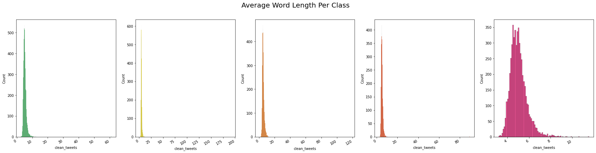
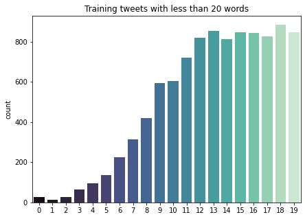
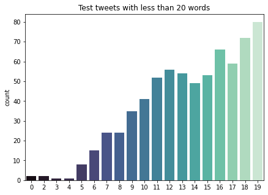
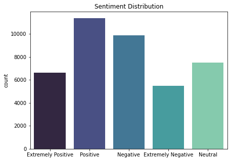
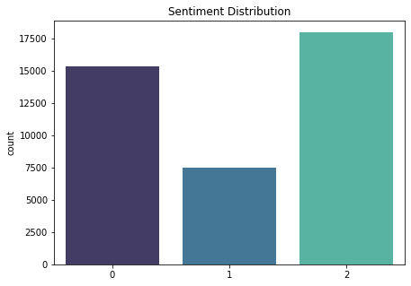
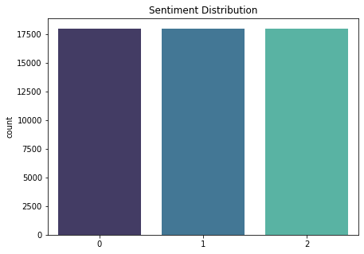
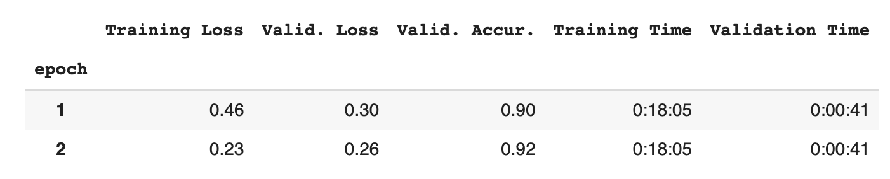
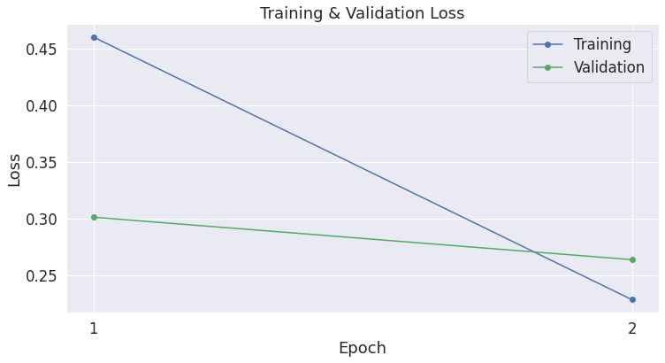
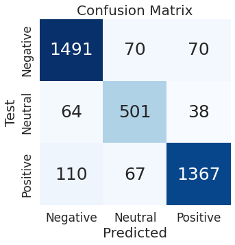
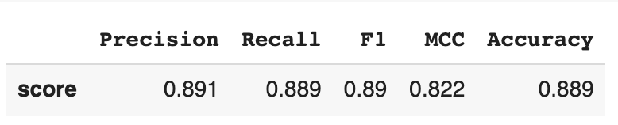

# Covid-19-Tweet-BERT-Sentiment-Analysis

### Quick overview:
Training &amp; fine-tuning BERT for Covid-19 tweet sentiment analysis, using PyTorch.

Due to a lack of local GPU, for accelerated training purposes, this project was done in Google Colab using access to the colab GPUs.

[Full project code](https://github.com/ckelaid/Covid-19-Tweet-BERT-Sentiment-Analysis/blob/main/Covid_19_Tweet_BERT_Sentiment_Analysis.ipynb)

##### BERT model & tokenizer used:
- BertTokenizer ('bert-base-uncased')
- BertForSequenceClassification

##### Training attributes:
- batch size of **16**
- **2** epochs
- learning rate of **2e-5**
- epsilon value of **1e-8**

### About the data:
The data was taken from a [Kaggle dataset](https://www.kaggle.com/datatattle/covid-19-nlp-text-classification).

It was comprised of two sets, one for training and one for testing, each with the following attributes:
- **Origina Tweet**: tweets about covid-19 in their raw form (uncleaned)
- **Location**: where the tweet was posted from
- **Tweet At**: the date the tweet was posted
- **Sentiment**: the sentiment attributed to the tweet [extremely negative, negative, neutral, positive, extremely positive]

The training set had **41157** tweets and the testing set had **3798**.

## Project
To begin, due to the raw nature of the tweets, some data cleaning was required, such as removing emojis, hashtags, mentions, etc.
Additionally, we checked for non-english tweets using **SpaCy** and dropped any that arose.

### EDA
After cleaning the tweets and dropping a few, I wanted to check of the average length of the tweets, to get an idea of what length was considered as a short tweet:

The reason for checking short tweets, was mainly to see if after the cleaning process we were left with any unusually short tweets (length < 4 or 5), which would mean that these most likely contained only links, mentions or hashtags, which are useless to attribute sentiment to.

  

As per the plots, we dropped any tweets of length 4 or less for both sets.

Once the data cleaning process was over, it was time to look at the sentiment distribution and see if any transformations were needed:

Instead of keeping these 5 classes, I limited myself to thee classes and numerized them - [negative = 0, neutral = 1, positive = 2]

As per the above plot however, the classes were really unbalanced so I performed Random Over Sampling to balance the classes:

### Results

#### Training summary:

 

#### Test Set Evaluation:

